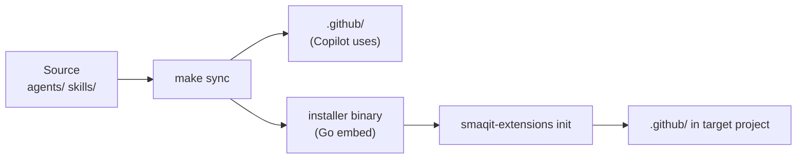
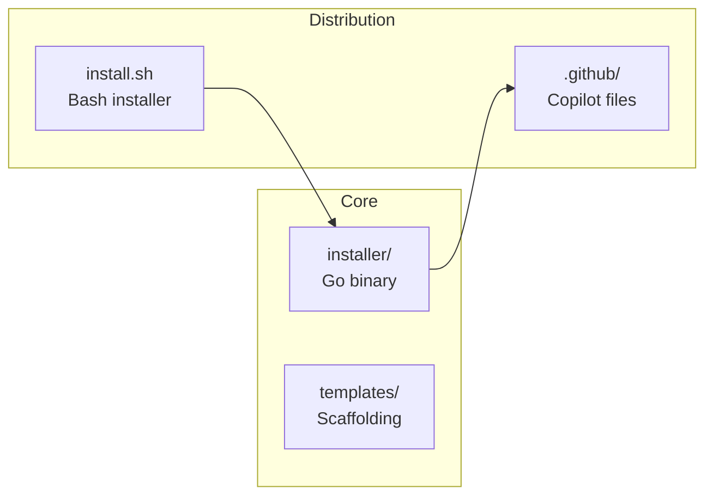
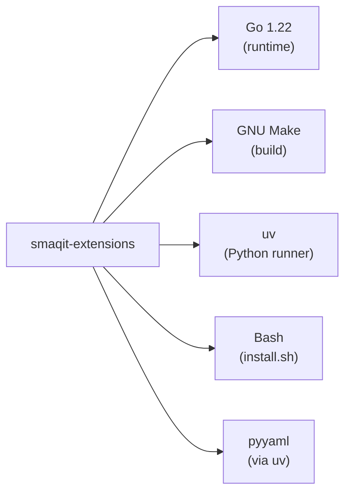

# Output Format Reference — smaqit.project-recap

**Version:** 0.2.0
**Purpose:** Section-by-section format templates and Mermaid examples for the `project.recap` dashboard

Read this file (Step 5 of SKILL.md) before generating the dashboard. Use the templates below as the canonical format for each section.

---

## Dashboard Header

```markdown
# Project Recap

> Generated: YYYY-MM-DD HH:MM | Source: live project scan | Run: `project.recap` | Sections: 8 core + Next Steps (0–8)

---
```

Replace `YYYY-MM-DD HH:MM` with the current UTC date and time.

---

## Section 0 — Situation Report

```markdown
## Situation Report

### Current State
[2–4 sentences describing what the project looks like today: active areas, maturity, recent focus]

### Direction
[2–4 sentences describing where the project is heading based on recent commit patterns]
```

**Rules for Section 0:**
- Always prose. No bullet lists, no tables, no Mermaid.
- Synthesized from git log output — NOT a list of commits.
- Keep it high-signal: what a new team member would want to read first to orient themselves.
- If git history is unavailable, write: `> No git history available for state inference.`

---

## Section 1 — Project Header

```markdown
## Project Header

| Field | Value |
|-------|-------|
| **Name** | [project name] |
| **Version** | [version string or "unknown"] |
| **Language / Runtime** | [e.g., Go 1.22, Python 3.12, Node.js 20] |
| **Entry Points** | [comma-separated list, e.g., `installer/main.go`, `install.sh`] |
```

**Extraction rules:**
- Name: prefer README `# Heading` level-1, then manifest `name` field
- Version: prefer manifest `version` field; fall back to most recent CHANGELOG `## [x.y.z]` heading; otherwise "unknown"
- Language: derive from file extensions in `src/`, manifest runtime field, or `go.mod`/`package.json` presence
- Entry points: prefer explicit mentions in README; supplement with `main.go`, `index.js`, `__main__.py`, `Makefile` targets

---

## Section 2 — Architecture Overview (Mermaid)

```markdown
## Architecture Overview


```

**Rules:**
- Use `flowchart LR` (left-to-right). Do NOT use `graph TD` or `block-beta` unless there is a strong reason.
- Keep to ≤15 nodes. Group related nodes if the diagram would exceed this limit.
- Node labels: use `\n` for multi-line. Wrap in `["..."]` for labels containing spaces or special chars.
- Show: primary inputs → transformation steps → distribution outputs. Omit internal implementation details.
- For non-smaqit projects: derive the flow from manifests, `Makefile` targets, and directory structure.

---

## Section 3 — Component Map

For skills/agents repos (type = smaqit extension), use a table grouped by category:

```markdown
## Component Map

| Category | Name | Type | Purpose |
|----------|------|------|---------|
| Session | smaqit.session-start | Skill | Load full project context at session start |
| Session | smaqit.session-finish | Skill | Document session history at completion |
| Release | smaqit.release.pr | Agent | PR-based release orchestration |
```

For code repos (packages/modules), use a Mermaid diagram:

```markdown
## Component Map


```

**Rules:**
- Derive categories from directory groupings or README section headings (e.g., "Session Management", "Task Tracking").
- Limit to top-level groupings. Do NOT list every individual method or file.
- If both skills and agents exist, include both in the same table with a `Type` column.

---

## Section 4 — Dependency Graph (Mermaid)

```markdown
## Dependency Graph


```

**Rules:**
- Top-level external dependencies only. No transitive/indirect dependencies.
- Sources: `go.mod` (`require` direct), `package.json` (`dependencies`/`devDependencies`), `requirements.txt`, `Cargo.toml` (`[dependencies]`), `Makefile` tool references.
- Label each node with the dependency name and version or role (e.g., `"Go 1.22\n(runtime)"`).
- If no dependencies are found, write: `> No external dependencies detected.`

---

## Section 5 — Directory Structure (ASCII)

```markdown
## Directory Structure

```
smaqit-extensions/
├── agents/          — source agent definitions (3 agents)
├── skills/          — source skill implementations (21 skills)
│   ├── smaqit.project-recap/
│   │   ├── SKILL.md
│   │   ├── scripts/
│   │   └── references/
│   └── ...
├── installer/       — Go binary (main.go, embed.go)
├── templates/       — project scaffolding templates
├── .github/         — synced agents + skills (Copilot uses these)
│   ├── agents/
│   └── skills/
└── .smaqit/         — project management state (tasks, history)
```
```

**Rules:**
- Curated, NOT a raw `tree` dump. 2–3 levels max.
- Annotate each top-level entry with a short purpose comment after `—`.
- Show representative subdirectories for important folders (e.g., one skill expanded to illustrate internal structure).
- Hidden directories (`.git`, `.github`, `.smaqit`) are included if significant to the project.

---

## Section 6 — Active Skills and Agents

```markdown
## Active Skills and Agents

| Name | Type | Version | Description |
|------|------|---------|-------------|
| smaqit.session-start | Skill | 0.7.0 | Load full project context at session start |
| smaqit.release.pr | Agent | 0.4.0 | PR-based release orchestration |
```

**Rules:**
- Derived from the `scan-metadata.py` output (Step 2 of SKILL.md) or the manual fallback.
- Sort by type (Agents first, then Skills), then alphabetically by name within each type.
- Truncate description to ~80 chars if too long (append `…`).
- If no components found, write: `> No skills or agents detected in this project.`

---

## Section 7 — Key Configuration Files

```markdown
## Key Configuration Files

| File | Purpose |
|------|---------|
| `go.mod` | Go module definition and dependencies |
| `Makefile` | Build, sync, and clean targets |
| `.github/copilot-instructions.md` | Copilot agent instructions and conventions |
| `.github/workflows/test-sync.yml` | CI sync verification |
| `install.sh` | Bash quick-install script |
| `.smaqit/tasks/PLANNING.md` | Central task tracking |
```

**Rules:**
- Include all significant config, manifest, and entrypoint files found in the project.
- Classify every file found in root + `.github/workflows/` + `.github/` + build directories.
- Omit generated files and lock files (e.g., `go.sum`, `package-lock.json`) unless they are the primary dependency source.
- If no configuration files found, write: `> No configuration files detected.`

---

## Section 8 — Next Steps

```markdown
## Next Steps

| Priority | Suggestion | Rationale |
|----------|-----------|-----------|
| 1 | [action] | [one-line reason] |
| 2 | [action] | [one-line reason] |
| 3 | [action] | [one-line reason] |
```

**Rules for Section 8:**
- 3–5 rows, ordered by priority (1 = highest).
- Derived from `smaqit.session-assess` output applied to the full dashboard.
- Focus on actionable improvements: gaps in coverage, missing documentation, architectural risks, process improvements.
- If `session.assess` was not available, write: `> Assessment not available — install smaqit.session-assess to enable next steps.`
- If your execution policy omits Section 8 when assessment is unavailable, add that omission note in the dashboard header instead.

---

## Sparse Section Handling

If a section has no data, include the heading and a note rather than omitting it:

```markdown
## Situation Report

> No git history available for state inference.

## Next Steps

> Assessment not available — install smaqit.session-assess to enable next steps.
```

This ensures sparse-state guidance exists for both Section 0 and Section 8 when those sections are rendered.
