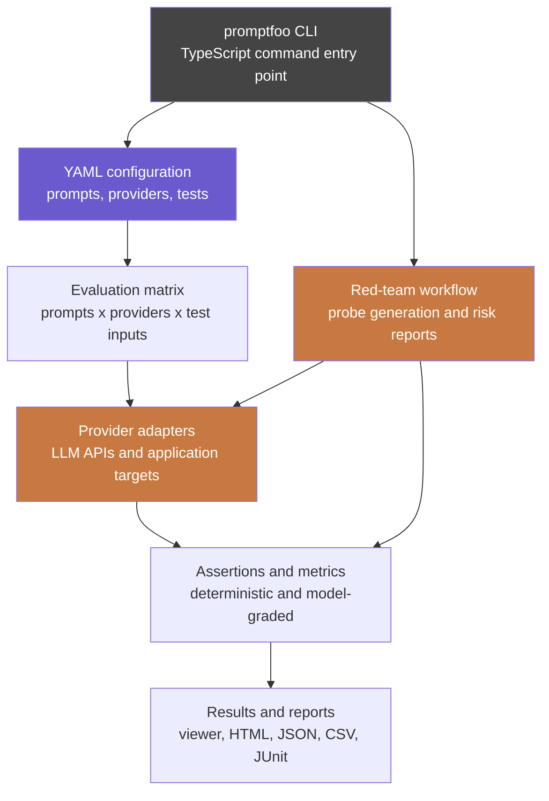

# Promptfoo architecture

```mermaid
flowchart TD
    CLI["promptfoo CLI\nTypeScript command entry point"]
    CONFIG["YAML configuration\nprompts, providers, tests"]
    MATRIX["Evaluation matrix\nprompts x providers x test inputs"]
    PROVIDERS["Provider adapters\nLLM APIs and application targets"]
    ASSERTIONS["Assertions and metrics\ndeterministic and model-graded"]
    REPORTS["Results and reports\nviewer, HTML, JSON, CSV, JUnit"]
    REDTEAM["Red-team workflow\nprobe generation and risk reports"]

    CLI --> CONFIG
    CONFIG --> MATRIX
    MATRIX --> PROVIDERS
    PROVIDERS --> ASSERTIONS
    ASSERTIONS --> REPORTS
    CLI --> REDTEAM
    REDTEAM --> PROVIDERS
    REDTEAM --> ASSERTIONS

    style CLI fill:#444,color:#fff
    style CONFIG fill:#6a5acd,color:#fff
    style PROVIDERS fill:#c87941,color:#fff
    style REDTEAM fill:#c87941,color:#fff
```
