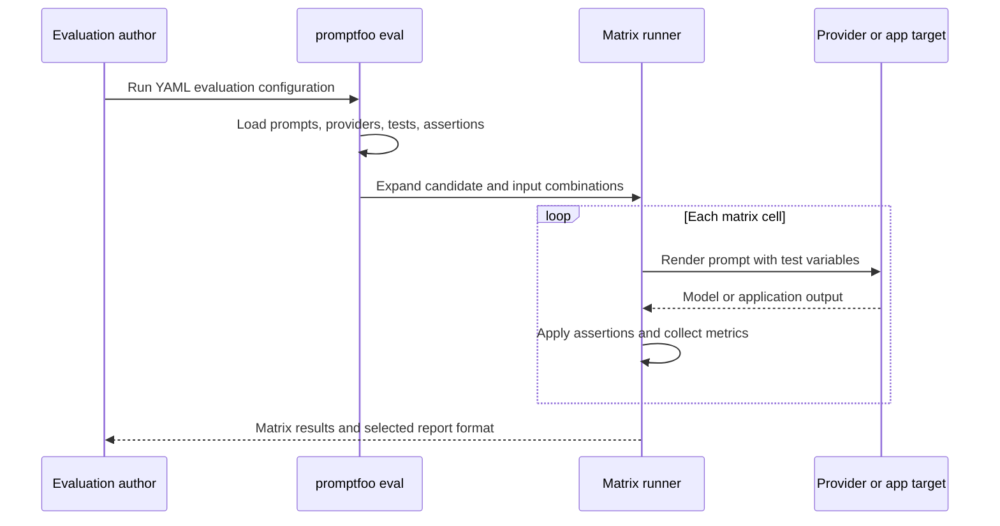

# Promptfoo evaluation flow

```mermaid
sequenceDiagram
    participant Author as Evaluation author
    participant CLI as promptfoo eval
    participant Matrix as Matrix runner
    participant Provider as Provider or app target

    Author->>CLI: Run YAML evaluation configuration
    CLI->>CLI: Load prompts, providers, tests, assertions
    CLI->>Matrix: Expand candidate and input combinations
    loop Each matrix cell
        Matrix->>Provider: Render prompt with test variables
        Provider-->>Matrix: Model or application output
        Matrix->>Matrix: Apply assertions and collect metrics
    end
    Matrix-->>Author: Matrix results and selected report format
```
