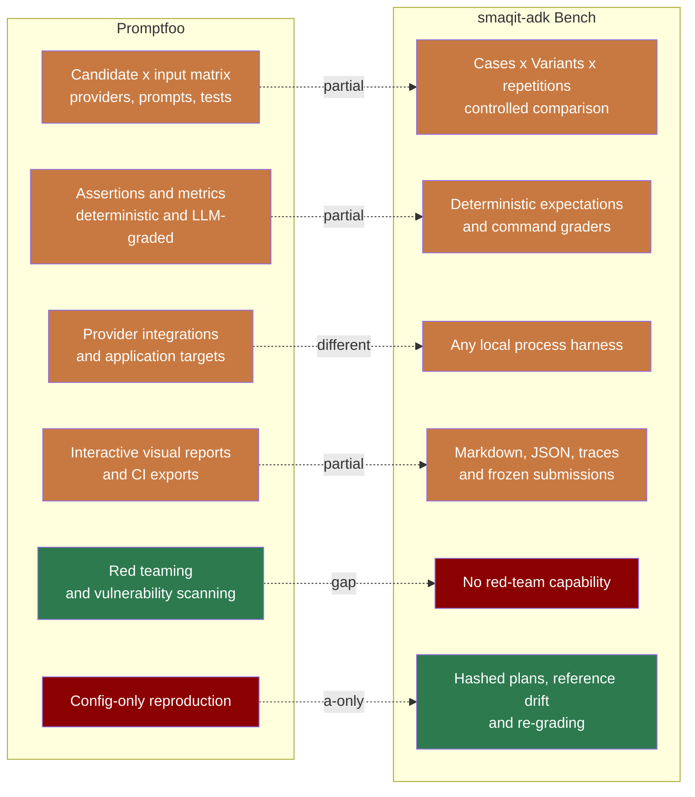

# Promptfoo and smaqit-adk Bench feature gap

```mermaid
flowchart LR
    subgraph P["Promptfoo"]
        P1["Candidate x input matrix\nproviders, prompts, tests"]
        P2["Assertions and metrics\ndeterministic and LLM-graded"]
        P3["Provider integrations\nand application targets"]
        P4["Interactive visual reports\nand CI exports"]
        P5["Red teaming\nand vulnerability scanning"]
        P6["Config-only reproduction"]
    end

    subgraph S["smaqit-adk Bench"]
        S1["Cases x Variants x repetitions\ncontrolled comparison"]
        S2["Deterministic expectations\nand command graders"]
        S3["Any local process harness"]
        S4["Markdown, JSON, traces\nand frozen submissions"]
        S5["No red-team capability"]
        S6["Hashed plans, reference drift\nand re-grading"]
    end

    P1 -.->|partial| S1
    P2 -.->|partial| S2
    P3 -.->|different| S3
    P4 -.->|partial| S4
    P5 -.->|gap| S5
    P6 -.->|a-only| S6

    style P1 fill:#c87941,color:#fff
    style S1 fill:#c87941,color:#fff
    style P2 fill:#c87941,color:#fff
    style S2 fill:#c87941,color:#fff
    style P3 fill:#c87941,color:#fff
    style S3 fill:#c87941,color:#fff
    style P4 fill:#c87941,color:#fff
    style S4 fill:#c87941,color:#fff
    style P5 fill:#2d7a4f,color:#fff
    style S5 fill:#8b0000,color:#fff
    style P6 fill:#8b0000,color:#fff
    style S6 fill:#2d7a4f,color:#fff
```
